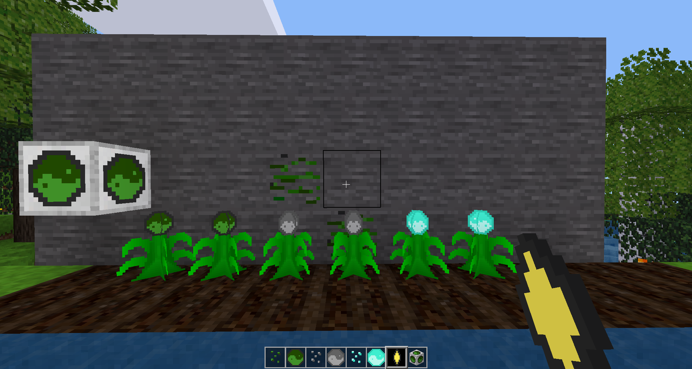

# Resource Crops [resource_crops]
Resource Crops adds crops to to grow many ores and elements, inspired by Mark719's Magical Crops mod for Minecraft

## Suggestions
It is extremely helpful to install a crafting guide such as [Unified Inventory](https://content.minetest.net/packages/RealBadAngel/unified_inventory/)
as there is no documentation (yet).

## Features
### Essence Ore
Essence Ore is found between depths of -5 and -5000.
### Essence Harvester
The Essence Harvester will harvest any fully grown resource crop directly under it and drop the item(s).
### Punch Harvesting
You can punch a fully grown crop to harvest it.
### Seeds
Seeds are placed on farmland, and only grow when it is wet and there is a light level of at least 8. Excess seeds can be crafted into their respective essence.
### Essences 
Essences are usually crafted into materials by filling the crafting grid, see special recipies with a crafting guide mod.
### Elemental Essences
Mostly used as another way to get misc items. Fire essence can be crafted with an item to smelt it.
Essence Smelting only currently works with metals that have existing crops and recipies from `minetest_game`
### Inferno Stone
The Inferno Stone can be crafted with an item to get the twice the result of smelting that item, it is not consumed by the recipe.
This only works on the same items as fire essence.

## Settings
Most features can be disabled at will through the settings.
The options have short descriptions found in the client interface settings or [`settingtypes.txt`](settingtypes.txt)
To change the config options of this mod, you have two options:

### Client Interface
1. With Minetest running, click the menu tab called "Settings".
2. Click the "Advanced Setting".
3. Open the "Mods" section.
4. Open the "resource_crops" subsection.
5. Change values as you wish!

### Text Editor or Server
1. Find "resource_crops" in your "mods" folder.
2. Open "settingtypes.txt", copy options you want to change, but not the lines starting with "#".
3. Find "minetest.conf" in minetest's main folder, it might be beside the "mods" folder.
4. Paste the options you copied into minetest.conf, change them to your liking.

## Compat
### Mods
~~This mod alters the growth of crops from the `farming` mod in `minetest_game`. Cotton and wheat now have a 4-step growth cycle like the other added crops.~~ 
Starting with v2.0.0, Resource Crops properly uses the `farming` API and no longer alters behavior.

Includes support for  
* [More Ores](https://content.minetest.net/packages/Calinou/moreores/)
* [Technic](https://content.minetest.net/packages/RealBadAngel/technic/)
* [Xtraores](https://forum.minetest.net/viewtopic.php?t=12798)

*Note, only the xtraores version by daviddoesminetest has been tested, other versions may be incompatible.  
*Note 2, xtraores metals level 9 (Rarium) and above are disabled by default for balancing, they can be enabled in settings.

### Minetest
Resource Crops v2.0.0 was developed on Minetest 5.8.0.
It might work on older versions, but I have not tested them.

## Changelog
See [`CHANGELOG.md`](CHANGELOG.md) for the changelog.

## License

- Resource Crops is licensed with the MIT license, see
  [`LICENSE.md`](LICENSE.md) for details.
